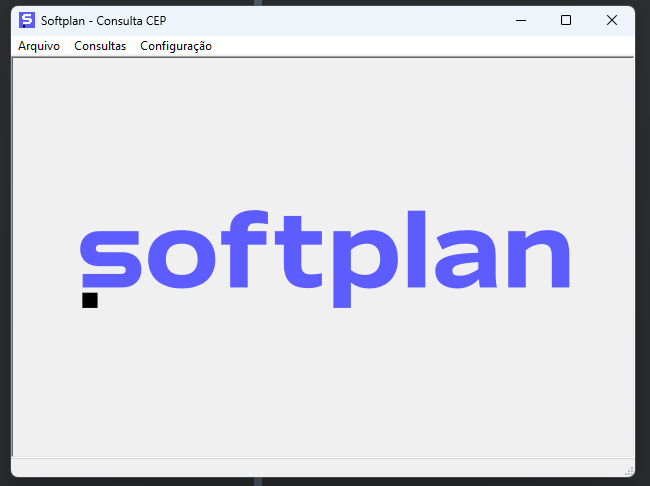
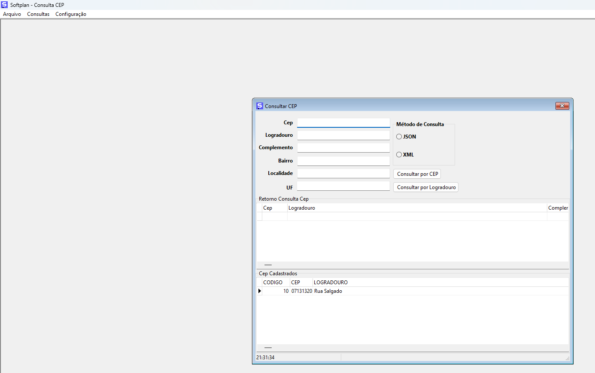
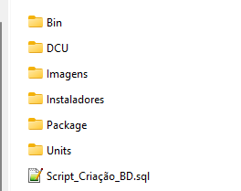
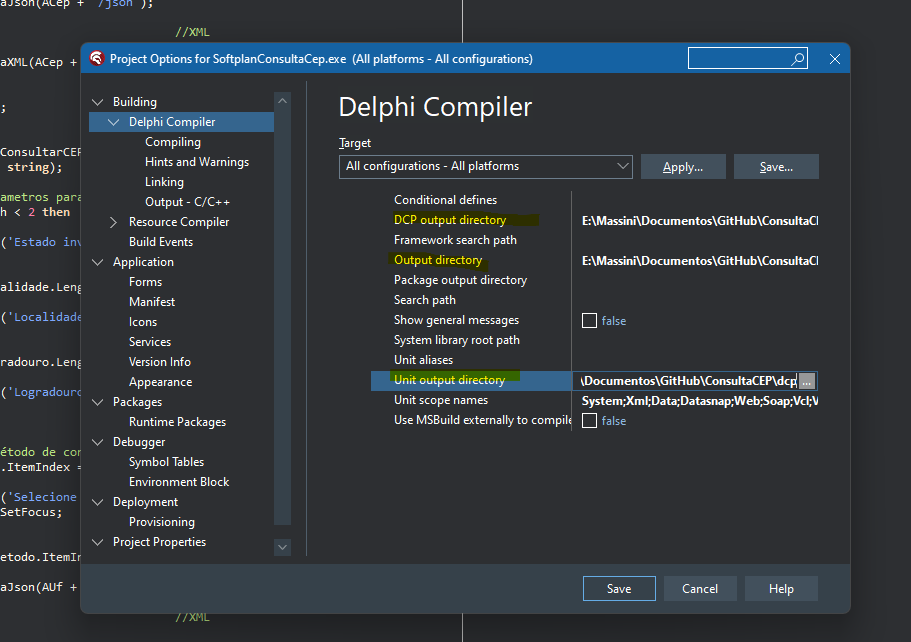

  

  
  
  
  
    
   

<h1 align="center">
    
</h1>

<h4 align="center"> 
	🚧  ConsultaCEP ♻️ Em Construção 🚀 🚧
</h4>

 <a href="#-sobre-o-projeto">Sobre</a> •
 <a href="#-funcionalidades">Funcionalidades</a> •
 <a href="#-layout">Layout</a> • 
 <a href="#-como-executar-o-projeto">Como executar</a> • 
<a href="#-entendendo-as-pastas-do-projeto">Entendendo as pastas do projeto</a> • 	
 <a href="#-autor">Autor</a> • 

## 💻 Sobre o projeto

♻️ ConsultaCEP - É uma aplicação com objetivo de consumir o WS da VIACEP.

**No desenvolvimento preferi só conectar ao banco de dados quando for gravar ou atualizar algum dado no banco de dados. Assim evitamos crash da aplicação por falta de conexão ao banco.**

Projeto desenvolvido em **Delphi XE Alexandria** e banco de dados **Firebird 2.5**

---

## ⚙️ Funcionalidades

- [x] **Consulta Cep via Json:**

  - [x] Utilizando o código do CEP
  - [x] Utilizando o Estado, Cidade, e nome da Rua

- [x] Grava na base de dados o CEP pesquisado
  - [x] Se já existe, atualiza o CEP na base de dados
  - [x] Se não existe, insere o CEP na base de dados

- [x] **Consulta Cep via Xml:**
  - [x] Utilizando o código do CEP
  - [ ] Utilizando o Estado, Cidade, e nome da Rua   🚧 Em Construção 🚀 🚧

- [x] Grava na base de dados o CEP pesquisado
  - [x] Se já existe, atualiza o CEP na base de dados
  - [x] Se não existe, insere o CEP na base de dados

---

## 🎨 Layout

O layout da aplicação é bem simples e objetivo:

<h1 align="center">
    
</h1>

---

### Pré-requisitos

Antes de começar, você vai precisar ter instalado em sua máquina as seguintes ferramentas:

💡[Firebird 2.5](https://firebirdsql.org/en/firebird-2-5/).

💡Os códigos-fontes podem ser abertos em **algumas versões anteriores do Delphi**, desde que já tenha o componente **Firedac nativo** (a partir de 2010).

💡Minha sugestão para manipulação do Banco de dados, a ferramenta **IBExpert** (o instalador esta no repositório)

---

## 🚀 Como executar o projeto

💡Baixar todo o repositorio do git e descompactar de preferencia numa pasta na unidade c:

---

### 🚀 Entendendo as pastas do projeto

<h1 align="center">
    
</h1>

- Bin: ✨Pasta onde está o binário da aplicação **SoftplanConsultaCep.exe** e onde está a pasta Database com o arquivo do banco de dados **CONSULTACEPDB.FDB**

- DCU: ✨Pasta onde estão os DCU's da aplicação

- Imagens: ✨Pasta onde estão imagens utilizados na aplicação e no repositório do GitHub

- Instaladores: ✨Pasta onde estão os instaladores do **Firebird** e do **IBExpert**

- Package: ✨ Pasta onde estão os arquivos do projeto em Delphi (**DPR, DPROJ E RES**)

- Units: ✨ Pasta onde estão todas as units do projeto (**códigos-fonte**)

- Script_Criação_BD.sql: ✨ Script de geração do banco de dados. Porém é **OPCIONAL**, pois já existe o arquivo do banco na pasta Bin\Database.

---

#### 1) Instalação Firebird🎲

💡A aplicação até abre sem o banco de dados, porém acontecerá um erro após consultar o cep.

💡Utilize o instalador dentro da pasta **Instaladores**, ou baixe diretamente do [Site](https://firebirdsql.org/en/firebird-2-5/)

💡Utilize como senha do banco, o padrão default do Firebird: **USER 'SYSDBA' PASSWORD 'masterkey'**

---

### 🧭 Rodando a aplicação no Delphi

💡**Acertar os diretórios de compilação do projeto no menu Project>Options>Delphi Compiler> Target**

- 💡**DCP output directory >>> Diretório onde descompactou\ConsultaCEP\DCU**

- 💡**Output directory >>> Diretório onde descompactou\ConsultaCEP\Bin**

- 💡**Unit output directory >>> Diretório onde descompactou\ConsultaCEP\DCU**

<h1 align="center">
    
</h1>

Ao compilar o projeto no Delphi, será gerado o arquivo **SoftplanConsultaCep.exe** dentro da pasta Bin.

---

## 🛠 Tecnologias

As seguintes ferramentas foram usadas na construção do projeto:

#### **Aplicativo Desktop -->> Delphi + Firebird**

---

## 🦸 Autor

Feito com ❤️ por <b>🚀[Cristhian Massini](https://www.facebook.com/cristhian.massini)</b> 👋🏽 [Entre em contato!](https://www.linkedin.com/in/cristhianmassini/)

 

---
